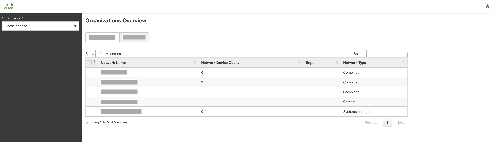
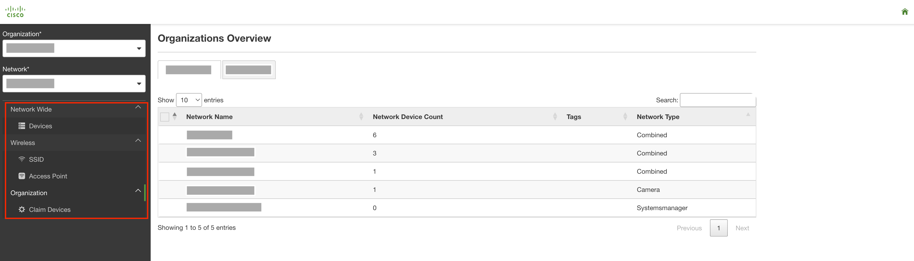
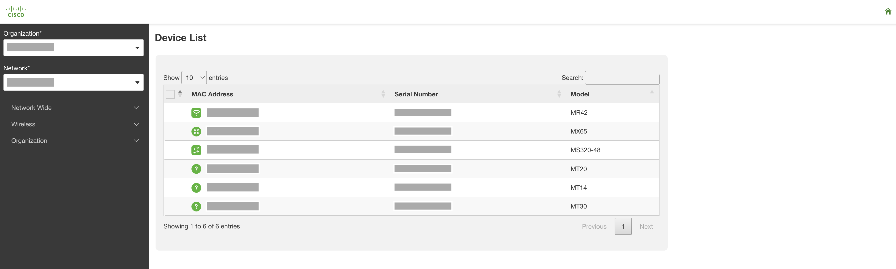
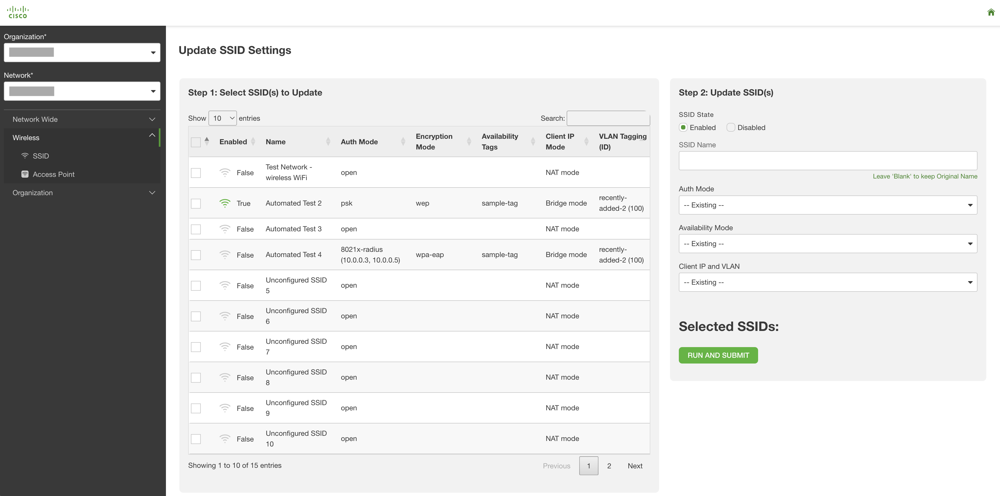
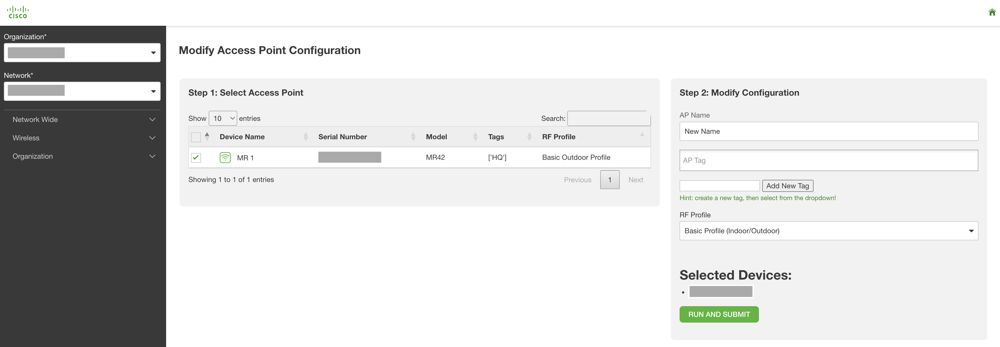
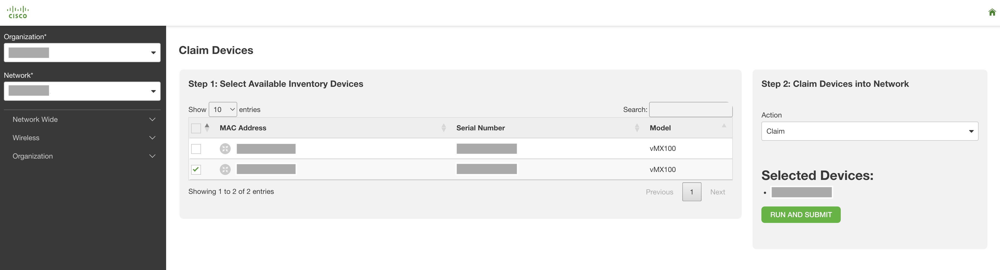

# Meraki Minified Dashboard 

This flask app is a 'minified' Meraki Dashboard, providing select functionality for contractors and others who need to manipulate a Meraki environment without access to the entire dashboard. The following features/workflows are currently supported:
* Claiming Devices
* Manipulating Access Points (Name, Tags, RF Profiles, etc.)
* Manipulating SSIDs (Name, Availability, Auth. Mode, VLAN Tagging, etc.)
* Organization Overview, List of Network Devices

The app was originally designed with wireless contractors in mind, but it's easily extendable by copying the framework supporting the existing pages (see `Expanding the App`).

## Contacts
* Trevor Maco
* Rey Diaz

## Solution Components
* Meraki

## Prerequisites
#### Meraki API Keys
In order to use the Meraki API, you need to enable the API for your organization first. After enabling API access, you can generate an API key. Follow these instructions to enable API access and generate an API key:
1. Login to the Meraki dashboard
2. In the left-hand menu, navigate to `Organization > Settings > Dashboard API access`
3. Click on `Enable access to the Cisco Meraki Dashboard API`
4. Go to `My Profile > API access`
5. Under API access, click on `Generate API key`
6. Save the API key in a safe place. The API key will only be shown once for security purposes, so it is very important to take note of the key then. In case you lose the key, then you have to revoke the key and a generate a new key. Moreover, there is a limit of only two API keys per profile.

> For more information on how to generate an API key, please click [here](https://developer.cisco.com/meraki/api-v1/#!authorization/authorization). 

> Note: You can add your account as Full Organization Admin to your organizations by following the instructions [here](https://documentation.meraki.com/General_Administration/Managing_Dashboard_Access/Managing_Dashboard_Administrators_and_Permissions).

#### Docker
This app provides a `Docker` file for easy deployment. `Docker` is the recommended deployment method. Install `Docker` [here](https://docs.docker.com/get-docker/).


## Installation/Configuration
1. Clone this repository with `git clone [repository name]`
2. Rename the `.env_sample` file to `.env`.
3. Add Meraki API key to environment variable in `.env`:
```dotenv
# Meraki Section
MERAKI_API_KEY=""
```
4. (Optional) Modify the `RADIUS_SERVERS` file contents (and value if using a different file name) and/or `DEFAULT_VLAN` variable in `config.py`. 
* RADIUS_SERVERS is an example of how to pre-encode a packaged group of settings to present a simplified option in the UI (in this example: radius servers used with [SSIDs](https://documentation.meraki.com/MR/Encryption_and_Authentication/RADIUS_Proxy_for_WPA2-Enterprise_SSIDs)). This pattern is reusable and streamlines the UI. 
* DEFAULT_VLAN is the default vlan as described in the VLAN tagging [documentation](https://documentation.meraki.com/MR/Client_Addressing_and_Bridging/VLAN_Tagging). It serves as an example of pre-encoding global default values where applicable.
```python
# Static JSON Files
RADIUS_SERVERS = "radius_servers.json"

# AP VLAN Tagging Config
DEFAULT_VLAN = 0
```
```json
[
  {
    "area": 1,
    "primary_server": {
      "host": "10.X.X.3",
      "port": 3000,
      "secret": "some-secret",
      "radsecEnabled": false
    },
    "secondary_server": {
      "host": "10.X.X.5",
      "port": 3000,
      "secret": "another-secret",
      "radsecEnabled": false
    }
  }
]
```
5. Set up a Python virtual environment. Make sure Python 3 is installed in your environment, and if not, you may download Python [here](https://www.python.org/downloads/). Once Python 3 is installed in your environment, you can activate the virtual environment with the instructions found [here](https://docs.python.org/3/tutorial/venv.html).
6. Install the requirements with `pip3 install -r requirements.txt`

## Usage
To run the program (from the top-level directory), use the following command to run with python directly:
```
$ python3 flask_app/app.py
```
or with the docker command:
```
$ docker-compose up -d --build
```

**Note:** App logs and output are written to Stdout console and log files in `flask_app/logs`

Once the app is running, navigate to http://127.0.0.1:5000 to be greeted with the main landing page (overview page):



Select an organization and network with the dropdown options on the left menu bar, and you will see all available workflows (**using the org and network as their context**):



In general, pages are divided into `informational` workflows (display information), and `configuration` workflows (modify state of object). For **configuration** workflows, select the object to modify with the checkbox (step 1), modify desired fields (step 2), and click **submit**.

Each workflow is shown below:

```Network Devices List``` (Informational)



* Display list of network devices with MAC, Serial, and Model. Device status reflected with symbol colors (the same coloring scheme used in the Meraki Dashboard).

```SSID``` (Configuration)



* Modify SSIDs in a particular network. Modify the SSID Name, Auth. Mode, Encryption Mode, VLAN Tagging, etc.

```Access Point``` (Configuration)



* Modify APs in a particular network. Modify the Device Name, Device Tags, and RF Profile.

``Claim Devices`` (Configuration)



* Claim Available Devices into a particular network. Only available devices from Organization Inventory will be displayed.

## Expanding the App

The app was purposely written to be modular and consistent in its design to encourage extensibility. The architecture of the app follows a simple Flask App:
* Core app logic (python) - `app.py`
* HTML Templates (html) - `templates/`
* CSS Stylesheets (css) - `static/`

Before adding new functionality, it's recommended to study the existing pages. In general, the important components are:
* **The HTML Page** (`*.html`): (extending the `masterPage.html`'s headers and footers plus the `menu.html`'s sidebar.)
* **The Flask Route** (`app.py`): each page has a route which reads in the various URL params and Form arguments (textbox input, dropdown selection, etc.), makes the appropriate Meraki API call with these values, and renders the HTML page for that workflow.
* **Menu.html Entry** (`menu.html`): this html page represents the menu bar on the left of the screen. Each workflow has an entry here with an `href` that calls the respective routes in `app.py`.

`Context` (the current org and network) is kept between flask calls with **URL Params**. This is critically important and leveraged in all routes and redirects.

When adding new functionality, it's recommended to copy an existing html page, route, and menu.html entry. Then from there, modify the html (tables, input fields), change the corresponding values read in the app.py route, add your underlying route logic, and finally, create an entry in menu.html.


### LICENSE

Provided under Cisco Sample Code License, for details see [LICENSE](LICENSE.md)

### CODE_OF_CONDUCT

Our code of conduct is available [here](CODE_OF_CONDUCT.md)

### CONTRIBUTING

See our contributing guidelines [here](CONTRIBUTING.md)

#### DISCLAIMER:
<b>Please note:</b> This script is meant for demo purposes only. All tools/ scripts in this repo are released for use "AS IS" without any warranties of any kind, including, but not limited to their installation, use, or performance. Any use of these scripts and tools is at your own risk. There is no guarantee that they have been through thorough testing in a comparable environment and we are not responsible for any damage or data loss incurred with their use.
You are responsible for reviewing and testing any scripts you run thoroughly before use in any non-testing environment.